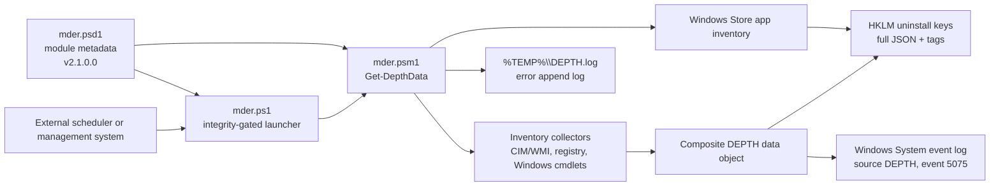
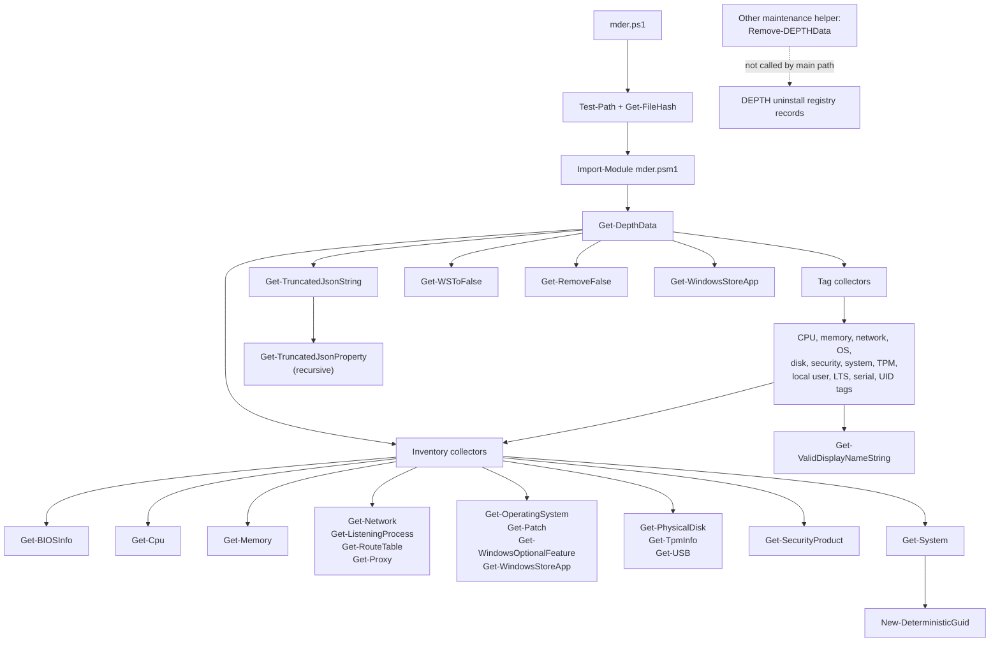
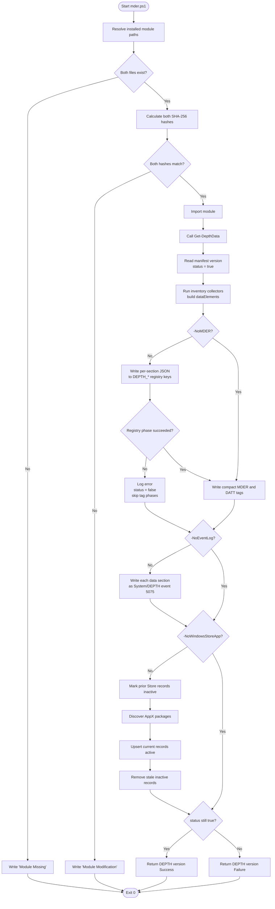
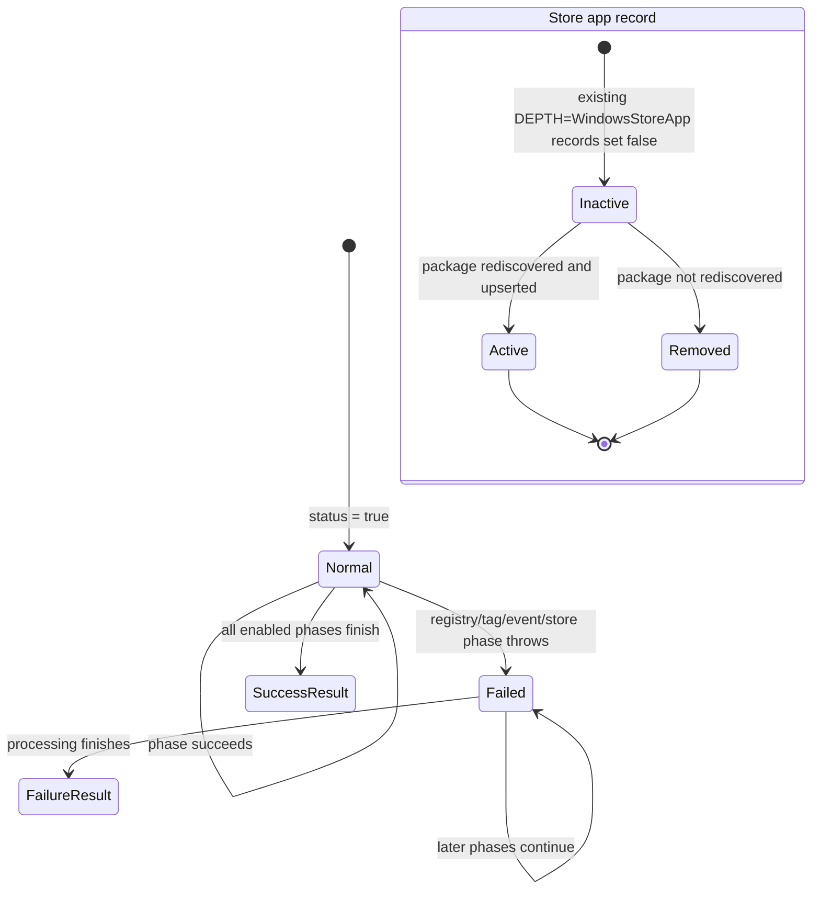

# MDER PowerShell Architecture

## Scope

This document describes `mder.ps1`, `mder.psd1`, and `mder.psm1`. It favors the main execution path and groups repetitive inventory/tag helpers.

## High-level architecture

`mder.ps1` is a small integrity-gated launcher. It expects the module and manifest under `%ProgramFiles%\MDER Sensor Package\tagScripts`, verifies both with fixed SHA-256 hashes, imports the module, and calls its only exported function, `Get-DepthData`.

`Get-DepthData` is the orchestrator. It gathers local Windows inventory into one object, then publishes overlapping views of that data for downstream collection:

- JSON records in uninstall registry keys for MDE/MDER retrieval.
- Compact tag records in uninstall registry keys.
- Event ID 5075 records in the Windows `System` log for AMA retrieval.
- Windows Store application records represented as uninstall registry entries.

Failures are normally converted into a `"DEPTH <version> Failure"` result while processing continues through later phases.

## Entry points

### `mder.ps1`

Primary executable entry point:

1. Builds installed paths under `%ProgramFiles%\MDER Sensor Package\tagScripts`.
2. Requires both `mder.psm1` and `mder.psd1`.
3. Calculates SHA-256 hashes and compares them with embedded constants.
4. On a match, imports `mder.psm1` and invokes `Get-DepthData`.
5. On mismatch or missing files, writes a diagnostic message.
6. Always exits with code `0`.

The checked-in files do not currently match the embedded launcher hashes:

| File | Embedded expected hash | Checked-in file hash |
|---|---|---|
| `mder.psm1` | `1FAB5380…D340B21` | `848EC6FC…6F14FC` |
| `mder.psd1` | `3EACBEAE…920B308` | `43F6EAE4…7341BE4` |

If these exact checked-in files are installed at the expected path, the launcher reports module modification, skips collection, and still exits successfully.

### `Get-DepthData`

The manifest exports only `Get-DepthData`. Its switches selectively suppress output phases:

| Switch | Effect |
|---|---|
| `-NoMDER` | Skips full JSON registry publication. |
| `-NoEventLog` | Skips Windows event-log publication. |
| `-NoWindowsStoreApp` | Skips Windows Store app registry refresh. |
| `-NoRemoveOld` | Declared but not referenced; it currently has no effect. |

Direct module import also makes internal functions callable in normal PowerShell module scope, but they are not part of the manifest's public API.

## Function call graph

Repetitive inventory and tag helpers are collapsed by role.

### Major function groups

| Group | Functions | Responsibility |
|---|---|---|
| Orchestration | `Get-DepthData` | Builds scan data, controls publication phases, tracks overall status. |
| Core inventory | `Get-BIOSInfo`, `Get-Cpu`, `Get-Memory`, `Get-Network`, `Get-OperatingSystem`, `Get-Patch`, `Get-PhysicalDisk`, `Get-System`, `Get-TpmInfo`, `Get-USB` | Collects host, OS, hardware, patch, and network facts. |
| Network/security inventory | `Get-ListeningProcess`, `Get-Proxy`, `Get-RouteTable`, `Get-SecurityProduct`, `Get-WindowsOptionalFeature` | Collects listeners, proxy policies, routes, security controls, and optional roles/features. |
| Tag projection | `Get-*Tag`, `Get-LocalUserTag`, `Get-OSLTSTag`, `Get-SNTag`, `Get-UIDTag` | Converts selected inventory into compact display-name records. |
| Store app lifecycle | `Get-WindowsStoreApp`, `Get-WSToFalse`, `Get-RemoveFalse` | Discovers AppX packages, marks old records inactive, upserts current records, removes stale inactive records. |
| Serialization | `Get-TruncatedJsonString`, `Get-TruncatedJsonProperty` | Fits JSON into registry/event payload limits by recursively truncating properties. |
| Utilities | `Get-ValidDisplayNameString`, `New-DeterministicGuid` | Sanitizes tag strings and creates stable identifiers. |
| Maintenance | `Remove-DEPTHData` | Removes DEPTH data, but is not used by the current main path. |

## Main execution control flow

Collector failures can yield missing/null sections in `dataElements`; collection itself is not guarded by one outer `try/catch`. Each collector generally handles its own error and logs it.

## State transitions

There are two main state machines: overall scan status and Windows Store record activity.

Important details:

- `$status` begins as `$true` and is only changed to `$false`; no later phase resets it.
- `$successAddingTags` gates both compact tag groups. It becomes `$false` only when the full MDER registry phase throws.
- A disabled phase is treated as skipped, not failed.
- Store app records use `isActive` for mark-and-sweep behavior.
- The wrapper's process exit code does not reflect module success or failure because it unconditionally executes `exit 0`.

## Error handling

Most collector functions use the same pattern:

1. Run the query in `try`.
2. On error, append timestamped exception text to `%TEMP%\DEPTH.log`.
3. Return no useful object from the failed collector.

`Get-DepthData` has separate `try/catch` blocks for full registry publication, each tag family, event-log publication, and two Store app subphases. A caught phase error appends to the same log and sets `$status = $false`. Later phases usually continue.

Consequences:

- Partial inventory is expected and can still be published.
- Errors are not rethrown to the launcher.
- The return string carries success/failure, but `mder.ps1` does not turn it into a process failure.
- `Test-ModuleManifest` suppresses errors; a missing/invalid manifest can therefore make version handling fail later.
- Hash mismatch and missing-module conditions are informational output, not terminating failures.

## External dependencies

No third-party PowerShell module is declared in `mder.psd1`. Runtime dependencies are Windows facilities and inbox/role-specific cmdlets:

- PowerShell module manifest support and Windows PowerShell-compatible cmdlets.
- CIM/WMI providers for computer, BIOS, CPU, memory, disks, OS, patches, routes, TPM, and USB.
- Networking cmdlets such as `Get-NetAdapter`, `Get-NetTCPConnection`, and `Get-NetFirewallProfile`.
- Security cmdlets such as `Get-MpComputerStatus`, `Get-BitLockerVolume`, `Get-AppLockerPolicy`, and TPM cmdlets.
- AppX package support through `Get-AppxPackage`.
- Windows event log APIs and cmdlets.
- Registry provider access to `HKLM:`.
- Optional Active Directory support: `Get-System` attempts `Import-Module`/`Get-ADForest`.
- Optional Windows Server role support through `Get-WindowsFeature`; feature detection selects an available mechanism.

Administrative rights are likely required for creating event sources and writing/removing `HKLM` registry keys.

## Scheduled and background tasks

The source creates no scheduled task, PowerShell job, runspace, timer, event subscription, service, or persistent worker. `ScanSource = "DEPTH Local Job"` is metadata only.

Recurring execution therefore depends on an external scheduler, endpoint-management product, service, or deployment wrapper not present in this directory. All collection and publication work is synchronous during one invocation.

## File, registry, event-log, and network interactions

### Files

- Reads installed `mder.psm1` and `mder.psd1` indirectly through path checks, hashing, module import, and manifest validation.
- Appends errors to `%TEMP%\DEPTH.log`.
- Does not write inventory payloads to ordinary data files.

### Registry

- Reads Windows version, browser proxy policies, Defender/McAfee and removable-storage policy values, plus existing DEPTH records.
- Writes under `HKLM:\SOFTWARE\Microsoft\Windows\CurrentVersion\Uninstall\DEPTH_*`.
- Full data uses serialized JSON in `UninstallString` and marks records with `DEPTH = MDER`.
- Tag records use uninstall metadata fields such as `DisplayName`, `DisplayVersion`, `InstallDate`, `InstallTime`, and `Publisher`.
- Store app records use deterministic keys/identifiers, `DEPTH = WindowsStoreApp`, and `isActive`.
- Deletes stale DEPTH records during cleanup.

### Event log

- Creates event source `DEPTH` in the `System` log if absent.
- Writes one informational event per populated data section.
- Uses event ID `5075` and category `0`.

### Network

- No direct HTTP, REST, socket client, download, or upload operation appears in the source.
- Network-related commands inspect local adapters, TCP listeners, routes, firewall state, and proxy policy.
- Active Directory forest discovery may contact domain infrastructure through `Get-ADForest`.
- Downstream MDE/AMA ingestion is indirect: this module writes registry/event-log data for other agents to collect.

## Readability-oriented summary

The system is best understood as a synchronous endpoint inventory pipeline:

`integrity gate → collect local facts → project full and compact records → publish to registry/event log → refresh Store app records → return textual status`

The highest operational risks are silent process success on launcher/module failure, deployment hash drift, partial data hidden behind collector-level logging, and Windows/admin/environment-specific cmdlet availability.
